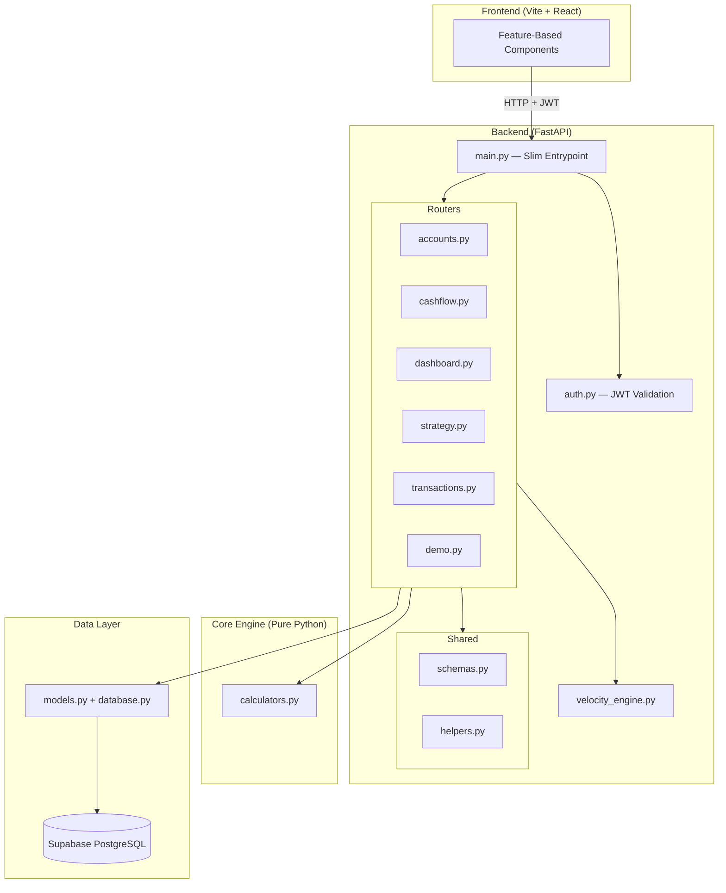
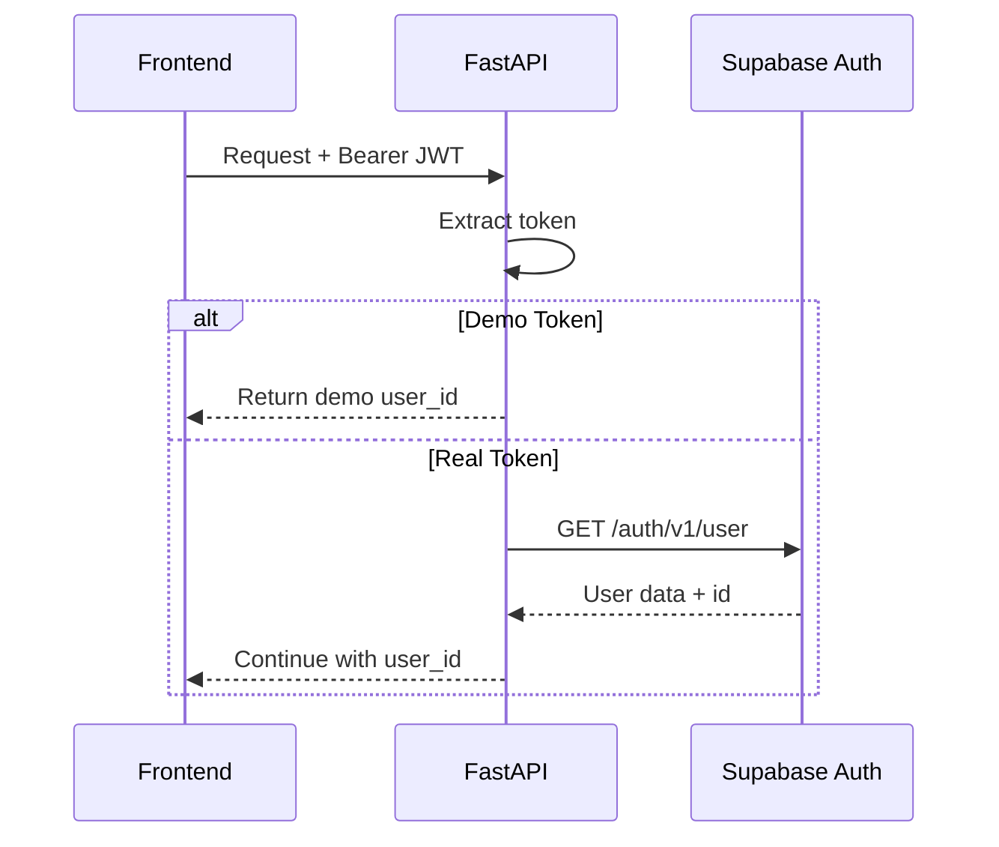
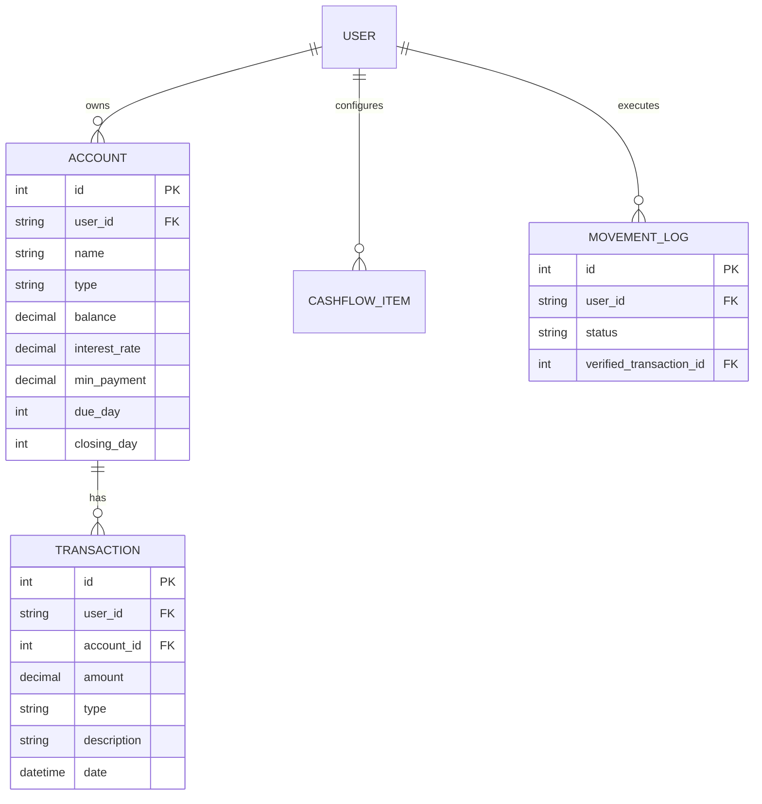

# CoreX Architecture

## System Overview

## Design Principles

| Principle               | Implementation                                               |
| ----------------------- | ------------------------------------------------------------ |
| **Separation of Concerns** | Routers handle HTTP, `velocity_engine.py` handles math, `core_engine/` holds pure functions |
| **Dependency Injection**    | Auth via `Depends(get_current_user_id)` — swappable for tests |
| **Config over Code**        | CORS origins, Supabase URL, etc. driven by `os.getenv()`      |
| **Fail Fast**               | Auth checks happen before any DB call                          |
| **Testability**             | In-memory SQLite + demo token for fast integration tests       |

## Authentication Flow

## Data Model

## Deployment

| Component | Platform | Config                      |
| --------- | -------- | --------------------------- |
| Frontend  | Vercel   | `vercel.json` (SPA rewrites)|
| Backend   | Railway  | `Procfile` (uvicorn)        |
| Database  | Supabase | Managed PostgreSQL          |
